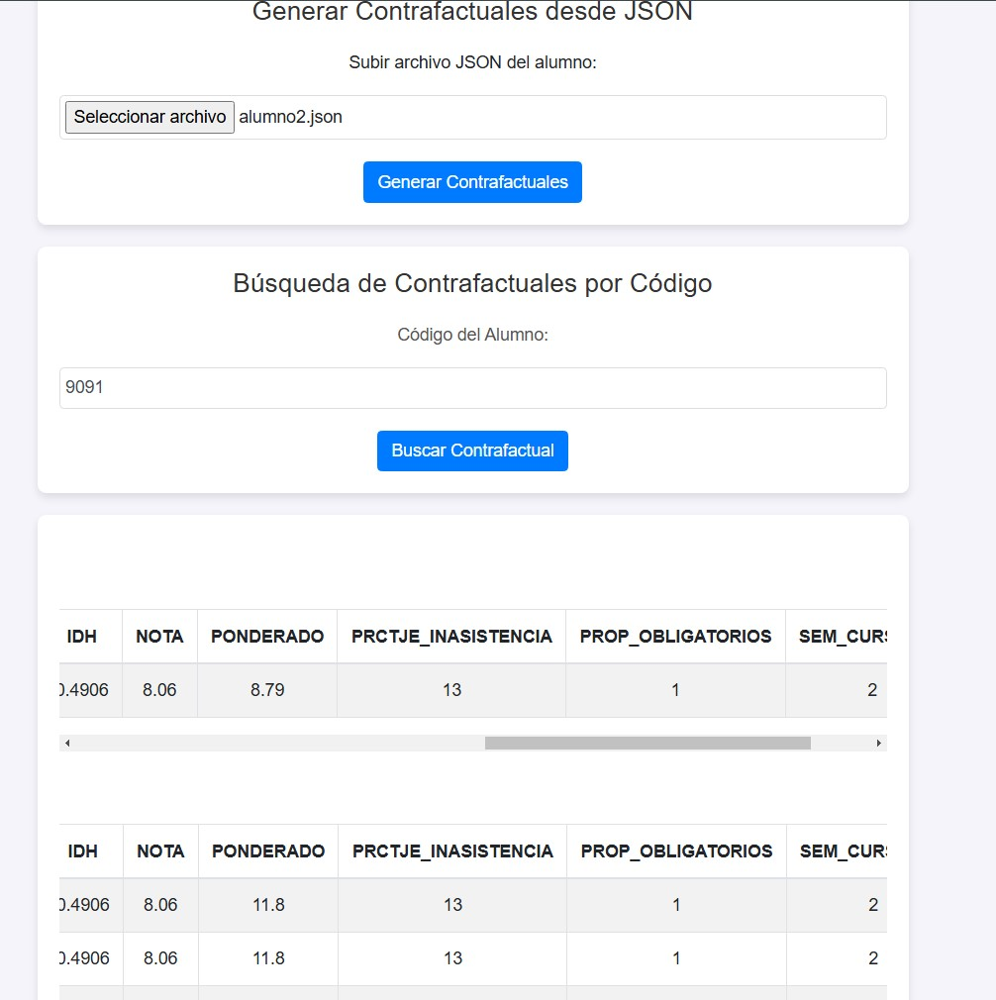
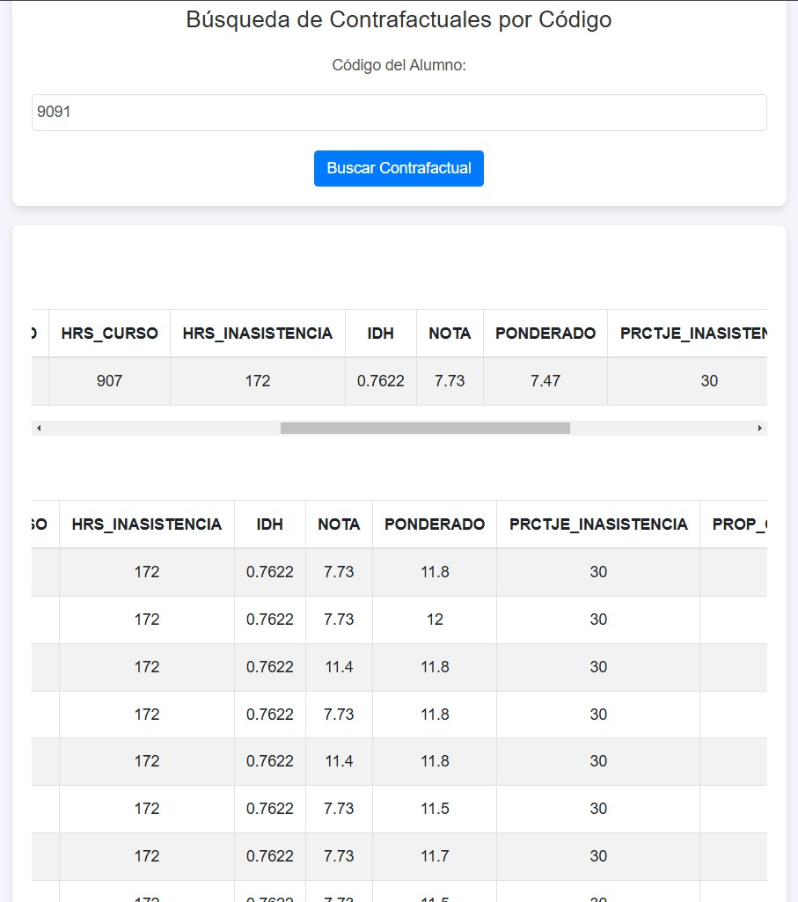

# Drop-Stopper-
[Guide 11 for Dpd] Drop Stopper es una web que permite hallar los contrafactuales para un alumno de la carrera de Ingeniería Industrial en Arequipa.

El modelo es un random forest y fue entrenado con un dataframe histórico de los alumnos de Ingeniería Industrial en cada curso y semestre. El dataset ha sido limpiado, transformado y enriquecido con **otro dataframe acerca de índices de desarrollo humano de la INEI**.

Ocupamos 3 pipelines de limpieza y handle errors, de esta manera zipeamos los records de un alumno a un vector característico listo para predecirse correctamente, posteriormente sacar sus contrafactuales, es decir, **¿Qué varío para que el alumno no haga DropOut?**

## USO

1. Correr el app.py, estará disponible para su uso en localhost.
2. Cargar el json si deseamos ver los contrafactuales de un alumno.
2.1 Podemos buscar los contrafactuales de un alumno, **cabe recalcar que los alumnos de interés son aquellos que se detecten como dropout**.

